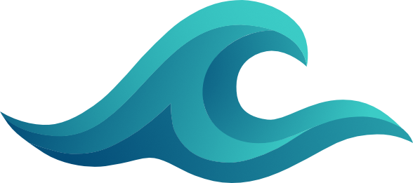

<p align="center">
  
</p>

<h1 align="center" style="border-width:0px;margin-bottom:0px">LakeQL</h1>
<div align="center" style="margin-bottom:50px;">Streamlined Data Access Layer for Data Platforms</div>

<p align="center">
  <a href="https://npmx.dev/package/@lakeql/api"></a>
  <a href="https://npmx.dev/package/@lakeql/cli"></a>
  <a href="https://npmx.dev/package/@lakeql/adapters"></a>
  <a href="https://npmx.dev/package/@lakeql/trino-client"></a>
  <a href="https://npmx.dev/package/@lakeql/query-builder"></a>
  <a href="https://npmx.dev/package/@lakeql/create-app"></a>
</p>

LakeQL is a monorepo that provides a type-safe GraphQL access layer for Trino-powered data platforms. It combines a backend runtime with a CLI that generates schema and query files from your existing data model.

The goal is to reduce manual boilerplate while keeping your API predictable, secure, and easy to extend.

## Features

- Type-safe GraphQL APIs for Trino-powered data platforms
- CLI-based schema generation from existing Trino metadata and table structures
- Built-in filtering, sorting, and pagination for generated queries
- Extensible response transformation with reusable helper packages
- Trino authentication with Basic Auth and OAuth flows
- Monorepo setup with reusable packages and a ready-to-use app template

## Requirements

- Node.js 24
- pnpm 11+

## Getting started

### Init project & setup

Run the following command in your terminal:

```bash
pnpm dlx @lakeql/create-app
```

Then follow the interactive setup.

The command bootstraps a project from the preconfigured template in [templates/app](./templates/app/).

### Schema generation

Run the interactive CLI to generate your schemas.

```bash
pnpm cli pull --source-path ./src
```

### Local development

To start local development, run:

```bash
pnpm dev
```

### Build & Production

The template ships with a production-ready `tsdown` setup.

Use `pnpm build` to generate the production `dist` output, which you can then use in your deployment setup (for example, in a Dockerfile).

## Learn more

Full docs and examples are available at https://lakeql.dev

## Contributing

- [Local Development](./LOCAL_DEVELOPMENT.md) — set up minitrino, seed test data, run queries
- [Contribution Guide](./apps/docs/content/lakeql/contributing/02.contribution-guide.mdx) — code style, changesets, project structure

## Project background

This project has its roots in the original [datalake-graphql-wrapper](https://github.com/dbsystel/datalake-graphql-wrapper).

LakeQL was later rebuilt from the ground up as a fully type-safe monorepo, with a complete refactoring of the codebase and architecture.

## Special thanks

- [Igal Klebanov](https://github.com/igalklebanov) and the [Kysely Team](https://github.com/kysely-org/kysely) - Kysely is used to generate valid SQL statements from GraphQL queries, and Igal helped make the query builder more generic.
- [Michael Hayes](https://github.com/hayes/pothos) - He created Pothos GraphQL, which is the foundation of our GraphQL server and its code-first schema generation approach.
