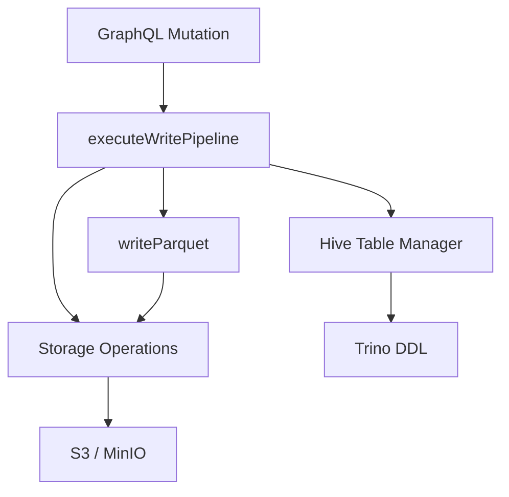

The `@lakeql/adapters` package provides the storage layer for LakeQL mutations. When a GraphQL mutation is executed, the adapters package handles everything from converting records to Parquet, uploading to object storage, and managing Hive external table DDL in Trino.

## What it does

The package is responsible for three core tasks:

1. **Parquet generation** — Converts input records to columnar Parquet format using `@lakeql/parquet`
2. **Object storage** — Uploads Parquet files to S3 or S3-compatible storage (MinIO, etc.)
3. **Hive DDL management** — Creates and manages external tables in Trino's Hive catalog so the data is immediately queryable

## Package exports

The main entry point (`@lakeql/adapters`) exports storage operations, the write pipeline, and the Hive table manager. See the [API Reference](/docs/adapters/api-reference) for the full list of exports.

## Architecture

The `executeWritePipeline` function orchestrates the full flow. It accepts records, a JSON Schema describing their shape, and a pipeline configuration that determines the load strategy, storage target, and table definition.

## Storage types

The adapters support two storage backends:

| Type | Description | Credentials |
| --- | --- | --- |
| `s3` | AWS S3 | `AWS_ACCESS_KEY_ID`, `AWS_SECRET_ACCESS_KEY` |
| `minio` | S3-compatible (MinIO, etc.) | `MINIO_ACCESS_KEY_ID`, `MINIO_SECRET_ACCESS_KEY` |

Both use the same S3 protocol under the hood. The `minio` type requires an explicit `endpoint` configuration.

## Installation

<Command variant="install">@lakeql/adapters</Command>

Peer dependencies for S3/MinIO storage:

<Command variant="install">
  @aws-sdk/client-s3 @aws-sdk/s3-presigned-post @aws-sdk/s3-request-presigner
</Command>
