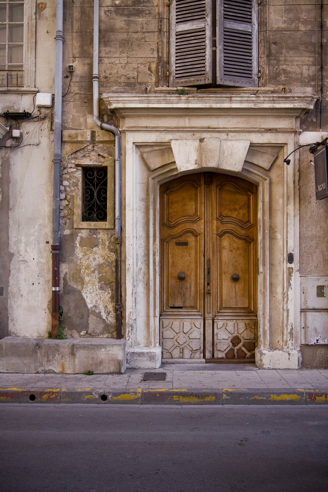

## Source

- https://unsplash.com/de/fotos/gebaude-aus-braunem-beton-CtkDsu4w-Rs
- https://unsplash.com/de/fotos/macbook-air-in-der-nahe-des-bechers-auf-dem-tisch-yC-Yzbqy7PY
- https://picsum.photos/

## local landscape


## remote landscape


## local portrait



## remote portrait


## Modes

### mode="default"

Rendert das Bild direkt im Content ohne Interaktion.

<Image
  src="https://picsum.photos/id/1018/1800/1100"
  alt="Default mode example"
  width={1800}
  height={1100}
  mode="default"
/>

### mode="zoom"

Rendert eine Preview (wie zuvor) und oeffnet beim Klick die Pan/Zoom-Ansicht.

<Image
  src="https://picsum.photos/id/1016/2400/1400"
  alt="Zoom mode example"
  width={2400}
  height={1400}
  mode="zoom"
/>

## Markdown syntax

Die Modi lassen sich auch direkt ueber das normale Markdown-Image-Tag setzen,
indem im optionalen Title-Teil Optionen uebergeben werden.

| Variante                   | Beispiel                                                                       | Ergebnis                       |
| -------------------------- | ------------------------------------------------------------------------------ | ------------------------------ |
| Title-Optionen (empfohlen) | ``       | Zoom-Preview mit cover         |
| Alt-Text-Hinweis           | `` | Zoom-Preview mit contain       |
| URL-Fragment               | ``         | Zoom-Preview mit cover         |
| Legacy Alias               | ``           | wird wie `mode=zoom` behandelt |

```mdx


```

Hinweis: `mode=preview` wird weiterhin als Alias fuer `mode=zoom` akzeptiert.

Live Beispiel:


