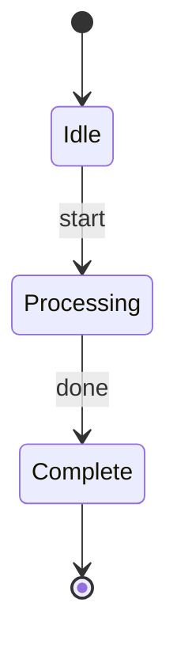
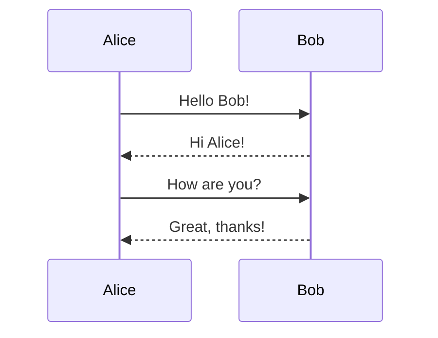
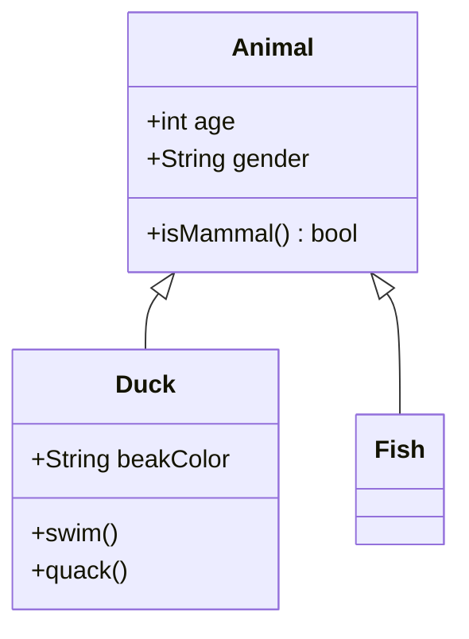
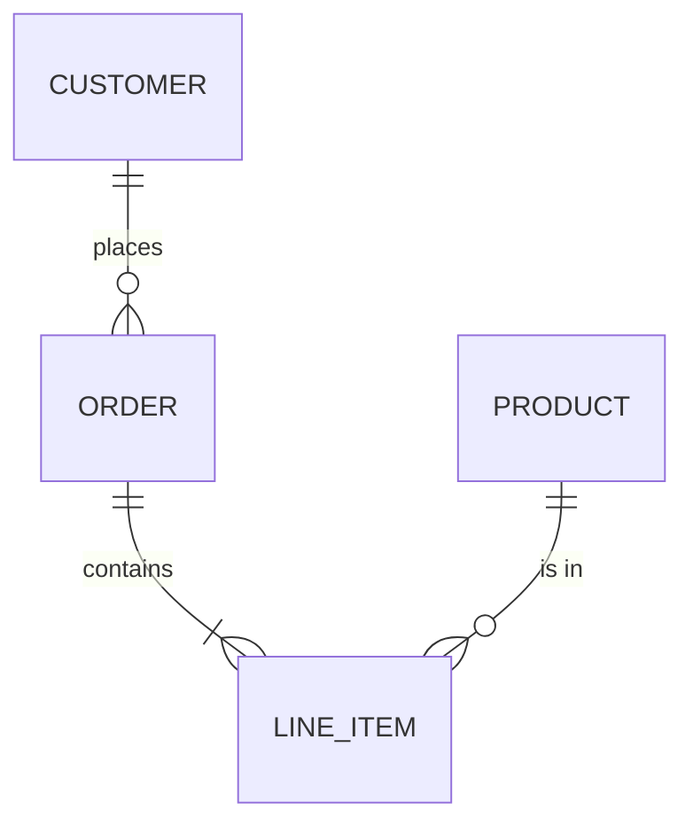
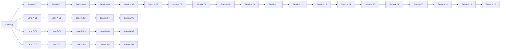
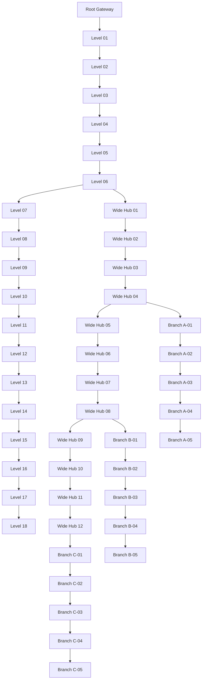

## State Diagrams

## State Diagrams 2

## Sequence Diagrams

## Class Diagrams

## Class Diagrams with preview

## ER Diagrams

## Cap Test (Vertical)

```mermaid
flowchart TB
  N01[Step 01] --> N02[Step 02]
  N02 --> N03[Step 03]
  N03 --> N04[Step 04]
  N04 --> N05[Step 05]
  N05 --> N06[Step 06]
  N06 --> N07[Step 07]
  N07 --> N08[Step 08]
  N08 --> N09[Step 09]
  N09 --> N10[Step 10]
  N10 --> N11[Step 11]
  N11 --> N12[Step 12]
  N12 --> N13[Step 13]
  N13 --> N14[Step 14]
  N14 --> N15[Step 15]
  N15 --> N16[Step 16]
  N16 --> N17[Step 17]
  N17 --> N18[Step 18]
  N18 --> N19[Step 19]
  N19 --> N20[Step 20]
  N20 --> N21[Step 21]
  N21 --> N22[Step 22]
  N22 --> N23[Step 23]
  N23 --> N24[Step 24]
  N24 --> N25[Step 25]
  N25 --> N26[Step 26]
  N26 --> N27[Step 27]
  N27 --> N28[Step 28]
  N28 --> N29[Step 29]
  N29 --> N30[Step 30]
```

## Cap Test (Horizontal)

## Cap Test (Combined: Vertical + Horizontal)

