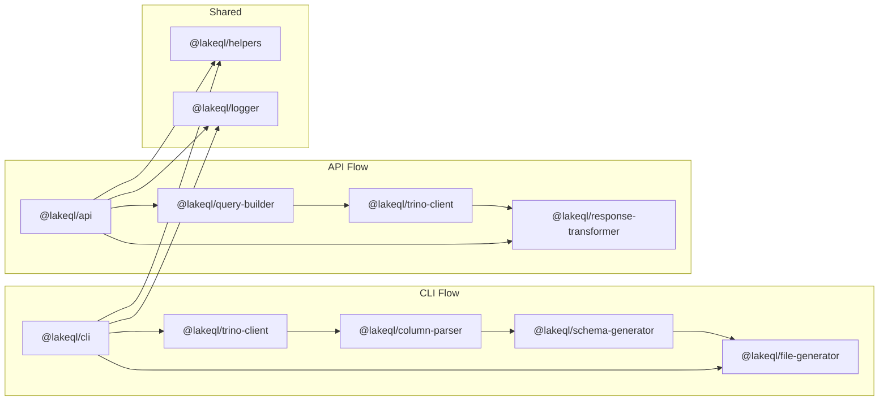

## Package Architecture

LakeQL's packages are organized around two distinct operational flows: the **CLI flow** for introspection and code generation, and the **API flow** for serving GraphQL queries at runtime.

## Package Dependency Diagram

## CLI Flow — Introspection and Generation

The CLI flow runs at development time. Its job is to connect to Trino, discover table structures, and write TypeScript source files.

| Step | Package                    | Action                                                   |
| ---- | -------------------------- | -------------------------------------------------------- |
| 1    | `@lakeql/cli`              | Parses CLI arguments, orchestrates the pipeline          |
| 2    | `@lakeql/trino-client`     | Executes `SHOW COLUMNS` against Trino                    |
| 3    | `@lakeql/column-parser`    | Parses raw type strings into structured definitions      |
| 4    | `@lakeql/schema-generator` | Generates GraphQL models, JSON schemas, type definitions |
| 5    | `@lakeql/file-generator`   | Writes TypeScript files to disk                          |

The output of this flow is committed to your repository and consumed by the API flow at runtime.

## API Flow — Serving and Querying

The API flow runs at production time. It serves a GraphQL endpoint and translates queries into Trino SQL.

| Step | Package                        | Action                                                  |
| ---- | ------------------------------ | ------------------------------------------------------- |
| 1    | `@lakeql/api`                  | Receives HTTP requests, runs auth, loads Pothos schemas |
| 2    | `@lakeql/query-builder`        | Translates GraphQL resolve info into Kysely SQL         |
| 3    | `@lakeql/trino-client`         | Submits SQL to Trino and polls for results              |
| 4    | `@lakeql/response-transformer` | Converts array responses to typed objects               |
| 5    | `@lakeql/helpers`              | Calculates pagination metadata                          |

## Design Principles

- **Single responsibility** — Each package does one thing well
- **Shared nothing** — Packages communicate through well-defined interfaces, not shared state
- **Generated over hand-written** — Prefer code generation over manual resolver authoring
- **Type safety everywhere** — TypeScript types flow from Trino metadata through to GraphQL responses
