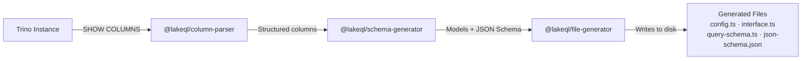

## The Generation Pipeline

When you run `lakeql-cli pull`, a multi-stage pipeline transforms Trino metadata into ready-to-use TypeScript source files.



## Stage 1: Trino Introspection

`@lakeql/trino-client` connects to your Trino instance and executes metadata queries:

```ts
// The CLI issues this for each table
SHOW COLUMNS FROM hive.sales.orders
```

Trino returns rows like:

| Column      | Type                                 | Extra | Comment |
| ----------- | ------------------------------------ | ----- | ------- |
| id          | bigint                               |       |         |
| customer_id | bigint                               |       |         |
| status      | varchar                              |       |         |
| metadata    | row(source varchar, version integer) |       |         |
| tags        | array(varchar)                       |       |         |

## Stage 2: Column Parsing

`@lakeql/column-parser` transforms raw type strings into structured objects. This handles Trino's complex type syntax including nested rows, arrays, and maps:

```ts
// Input: "array(row(id bigint, name varchar))"
// Output:
{
  kind: "array",
  element: {
    kind: "row",
    fields: [
      { name: "id", type: { kind: "scalar", base: "bigint" } },
      { name: "name", type: { kind: "scalar", base: "varchar" } }
    ]
  }
}
```

The parser handles all Trino types: `varchar`, `bigint`, `integer`, `double`, `boolean`, `date`, `timestamp`, `array(T)`, `map(K, V)`, and `row(...)`.

## Stage 3: Schema Generation

`@lakeql/schema-generator` takes the parsed column definitions and produces:

- **JSON Schema** — Describes the response structure for runtime transformation
- **GraphQL model definitions** — Pothos-compatible type and field definitions
- **TypeScript interface fields** — Mapped types for the interface file

This stage maps Trino types to TypeScript and GraphQL types:

| Trino Type  | TypeScript       | GraphQL          |
| ----------- | ---------------- | ---------------- |
| `bigint`    | `number`         | `Int` or `Float` |
| `varchar`   | `string`         | `String`         |
| `boolean`   | `boolean`        | `Boolean`        |
| `date`      | `Date`           | `Date`           |
| `timestamp` | `Date`           | `DateTime`       |
| `array(T)`  | `T[]`            | `[T]`            |
| `row(...)`  | nested interface | nested type      |

## Stage 4: File Generation

`@lakeql/file-generator` writes the final TypeScript source files to disk. Each file is formatted and ready to be imported by the API server.

After generation, the CLI also updates the **config registry** — an aggregated index file that imports all generated configs:

```ts path="src/config-registry.ts"
import { ordersConfig } from "./schemas/generated/hive/sales/orders/config"
import { customersConfig } from "./schemas/generated/hive/sales/customers/config"

export const allConfigs = [ordersConfig, customersConfig] as const
```

This registry is what the API server uses to discover and load all available table schemas.

## Re-running the Pipeline

The pipeline is idempotent. Running `pull` again overwrites existing generated files with fresh versions based on current Trino metadata. This makes it safe to re-run whenever table schemas change.

<Warning>
  If you've made manual edits to generated files (e.g. adding custom fields to
  `query-schema.ts`), those changes will be lost on the next `pull`. Place
  custom resolvers in separate files instead.
</Warning>
