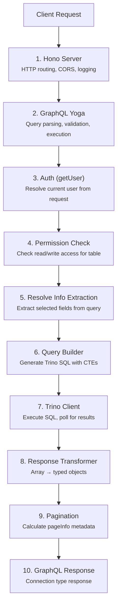

## Runtime Request Flow

Every GraphQL query follows a predictable path through LakeQL's API runtime. Understanding this flow helps with debugging and extending the system.



## Step-by-Step Breakdown

### 1. Hono Server

The request hits the Hono HTTP framework. Middleware handles:

- Request logging via `hono/logger`
- CORS headers for cross-origin requests
- Routing to the GraphQL endpoint (default: `/graphql`)

```ts
app.on(
  ["POST", "GET", "OPTIONS"],
  "/graphql/*",
  cors({ origin: "*", allowHeaders: ["content-type", "authorization"] }),
  serveYoga({ yoga })
)
```

### 2. GraphQL Yoga

GraphQL Yoga takes over, parsing the query string, validating it against the schema, and beginning field resolution. The Pothos-generated schema defines which fields and types are available.

### 3. Authentication (getUser)

The context factory calls `getUser(req)` to resolve the current user from the request. The default implementation supports:

- **Mock auth** — When `AUTH_MOCK=true`, any request with the correct `AUTH_MOCK_TOKEN` is authenticated. The `x-username` header sets the user identity.
- **Custom auth** — You can provide your own `getUser` resolver in `defineConfig` to integrate JWT validation, OAuth2, or any other auth mechanism.

```ts
// Default mock auth behavior
if (
  authHeader &&
  env.AUTH_MOCK === true &&
  authHeader === env.AUTH_MOCK_TOKEN
) {
  return {
    userName: req.headers.get("x-username") ?? "###FALLBACK_MOCK_USER###",
  }
}
```

### 4. Permission Check

Before executing the resolver, the system checks whether the authenticated user may access the requested table:

- **Read permission** — Default-allow for users without explicit rules (Trino handles authorization). Explicit deny for technical users without matching `Query` rules.
- **Write permission** — Default-deny. Requires an explicit `Mutation` rule matching the catalog, schema, and table.

### 5. Resolve Info Extraction

The resolver extracts the requested fields from GraphQL's `resolveInfo` object. Only fields the client actually selected are included in the SQL query:

```ts
// If the client requests { nodes { id, name } }
// selectFields becomes ["id", "name"]
const selectFields = getSelectFields(info, true)
```

### 6. Query Builder

`@lakeql/query-builder` generates a Trino SQL statement using Kysely. The query uses two CTEs:

```sql
-- CTE 1: Count total matching records
WITH total_count AS (
  SELECT COUNT(*) AS total_records
  FROM hive.sales.orders
  WHERE status = 'shipped'
),
-- CTE 2: Fetch the requested page of records
records AS (
  SELECT id, name
  FROM hive.sales.orders
  WHERE status = 'shipped'
  ORDER BY id ASC
  FETCH FIRST 10 ROWS ONLY
)
-- Combine both results in a single response
SELECT * FROM total_count FULL JOIN records ON TRUE
```

This dual-CTE approach retrieves both the total count and the paginated results in a single query to Trino.

### 7. Trino Client

`@lakeql/trino-client` submits the SQL to Trino's REST API. It handles:

- Statement submission via POST
- Polling the `nextUri` until results are ready
- Authentication headers (Basic or Bearer)
- Error handling and retry

### 8. Response Transformer

Trino returns data as arrays (e.g. `[1001, 42, "shipped", 249.99]`). The response transformer maps these arrays to named objects using the JSON schema definition:

```ts
// Input from Trino:  [1001, 42, "shipped", 249.99]
// Output:            { id: 1001, customer_id: 42, status: "shipped", total: 249.99 }
```

This also handles nested objects (Trino `row` types) and arrays.

### 9. Pagination Calculation

The helpers package calculates pagination metadata from the total count, current offset, and page size:

```ts
{
  hasNext: true,
  hasPrevious: false,
  currentPage: 1,
  maxPages: 15,
  nextPage: 2,
  previousPage: null
}
```

### 10. GraphQL Response

The final response is returned as a GraphQL Connection type:

```json
{
  "data": {
    "orders": {
      "totalCount": 142,
      "pageInfo": { "hasNext": true, "currentPage": 1, "maxPages": 15 },
      "nodes": [{ "id": 1001, "status": "shipped" }]
    }
  }
}
```
